# Online Manga Reading Website

A full-stack web application for reading and managing manga, built with **ASP.NET MVC (C#)** following the MVC architectural pattern.

| | | |
|---|---|---|
| 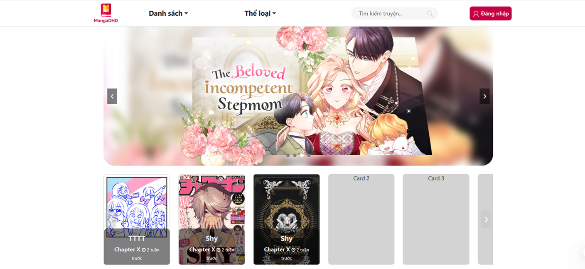 | 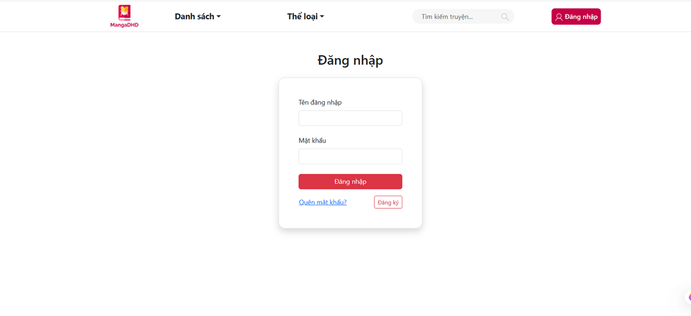 | 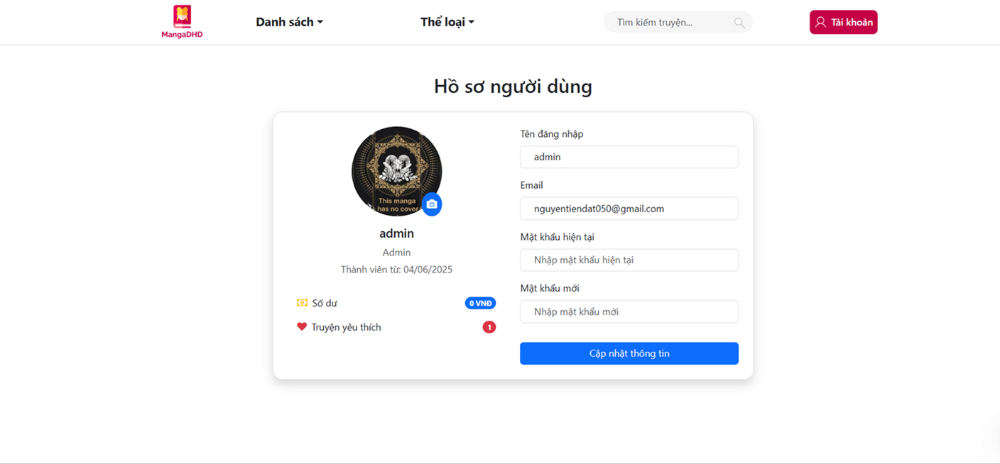 |
| 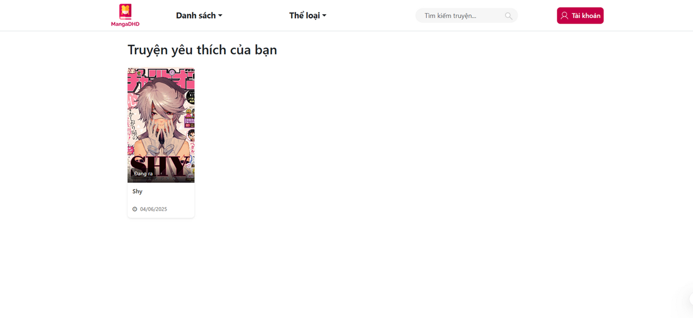 | 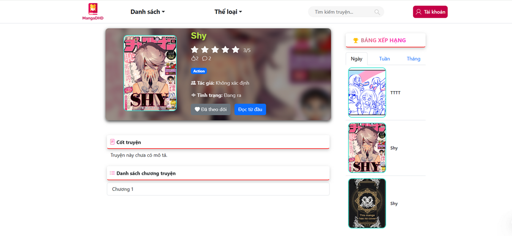 | 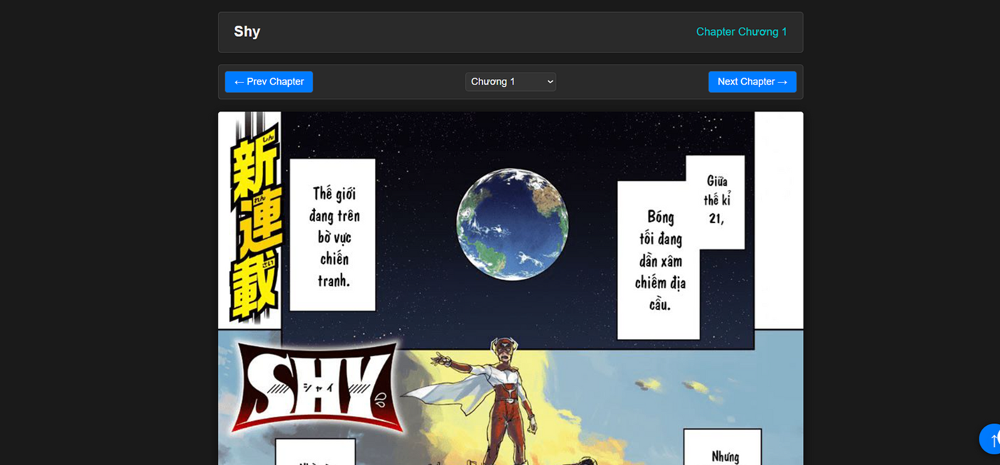 |
| 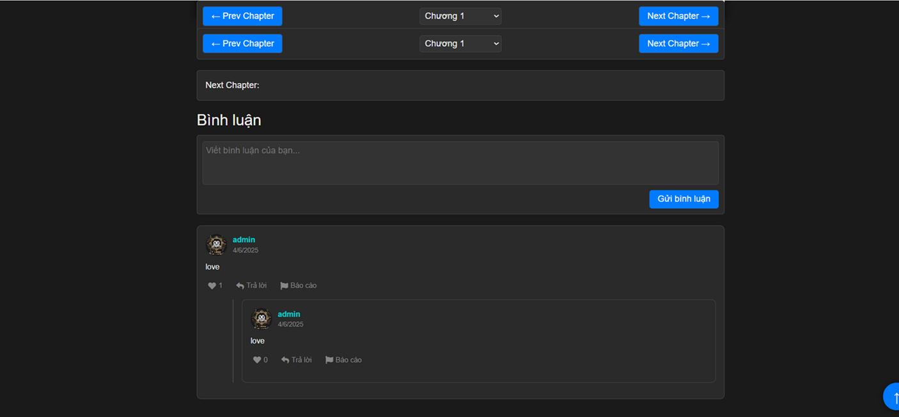 | 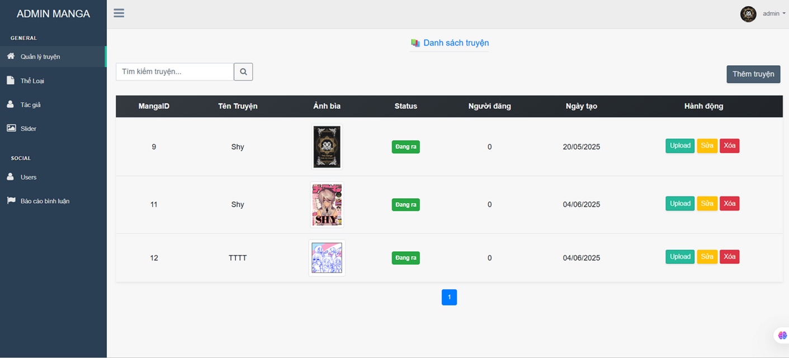 | 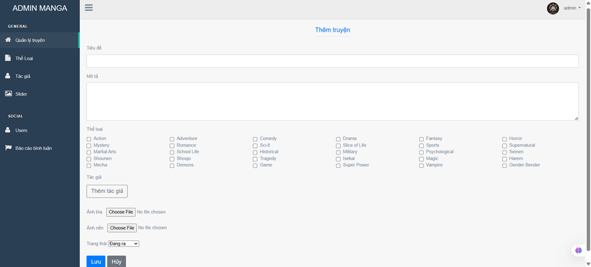 |
| 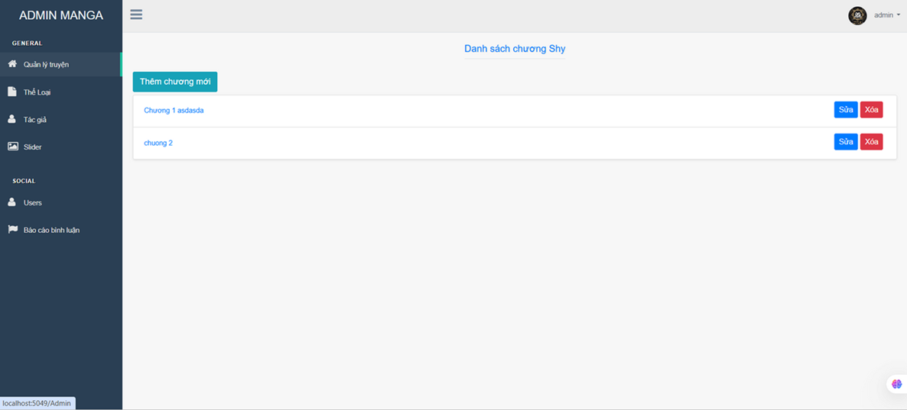 | 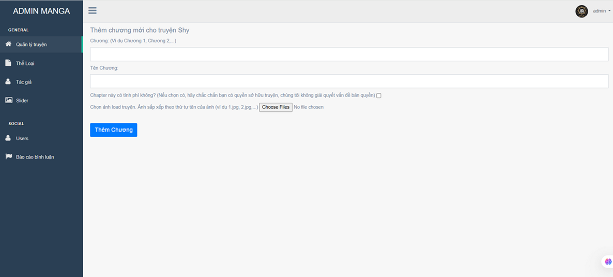 | 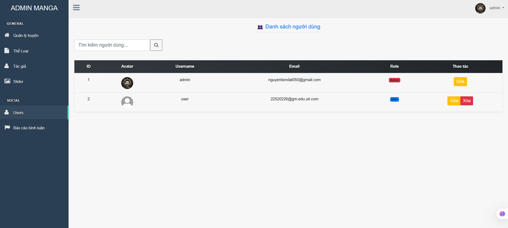 |
---

## Features

**User-facing**
- Browse manga by title, genre, and author
- Read chapters page by page
- Coin-based chapter unlock system (Balance)
- Threaded comment system per chapter with reply support, likes, and reporting

**Admin / Management**
- User account management with role-based access control
- Manga management with master-detail structure: Manga → Chapters → Content pages
- Genre and author management with many-to-many relationships via bridge tables
- Comment moderation (soft delete, report review)

---

## Tech Stack

- **Backend:** C#, ASP.NET MVC, Entity Framework (Database First)
- **Authentication:** ASP.NET Identity (role-based access, password hashing)
- **Database:** SQL Server
- **Frontend:** HTML, CSS, SCSS, JavaScript
- **IDE:** Visual Studio

---

## Database Schema

| Table | Description |
|---|---|
| Account | User accounts (username, email, hashed password, avatar, role, balance) |
| Manga | Manga entries (title, description, cover/background image, status) |
| Chapter | Chapters per manga (title, alias, price) |
| Content | Page images per chapter (ordered by ContentNum) |
| Genre / Bridge\_Manga\_Genre | Genres with many-to-many manga mapping |
| Author / Bridge\_Manga\_Author | Authors with many-to-many manga mapping |
| Comment | Threaded comments per chapter (supports replies via ParentCommentId, soft delete) |
| CommentLike | Like tracking per comment per user |
| CommentReport | Report submissions per comment with optional reason |

---

## Getting Started

### Prerequisites

- Visual Studio 2022+
- SQL Server (local or remote)
- .NET Framework / .NET (matching project target)

### Setup

1. Clone the repository.
2. Run `SQL Script.sql` against your SQL Server instance to create and seed the database.
3. Update the connection string in `Web.config` to point to your database.
4. Build and run the project in Visual Studio.

---

## Project Structure

```
WebTruyenTranh/
├── Controllers/       # MVC Controllers for each module
├── Models/            # Entity Framework Database First models
├── Views/             # Razor views (.cshtml)
├── Areas/             # Admin area (if separated)
└── Web.config         # Connection string and app settings
Frontend/              # Static frontend assets (HTML, CSS, SCSS, JS)
SQL Script.sql         # Database creation and seed script
```
